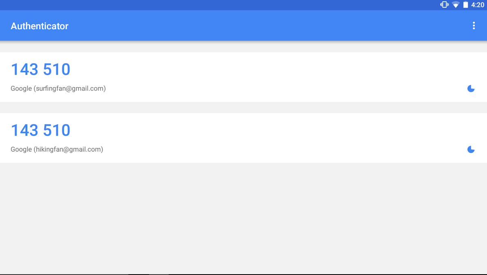
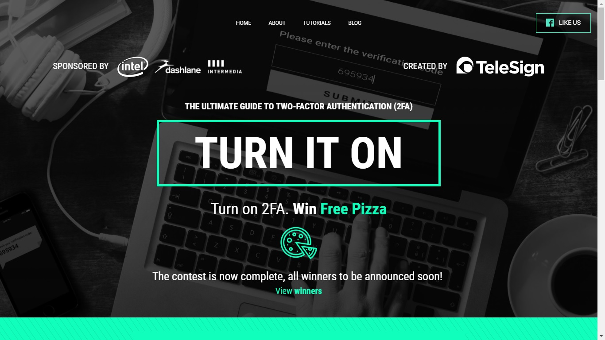

What if someone figured out your email password? How exposed would you be? What about your sources?

The consequences of such case could be nasty. Even more if we consider that lots of people use the same password for multiple services (which, itself, is not recommended at all).

The good news is that there's a way to improve the security on your password-protected services, and you probably use something similar on your mobile banking app: two-factor authentication (or verification), or simply 2FA.

!!! Two-factor authentication and verification are two names for the same safety measure

2FA is an extra layer of security, after using a password. Just like when you're trying to access your bank account and need to input some sort of _token_ number after entering your password.

Other services have been using this technique (for free) in order to improve security. You may see this in emails, social media and cloud services, for instance.

With 2FA, even if someone figures out your password, they won't have direct access to your account. 

The authentication method varies. There are services which will send you a SMS message. Others (more secure ones, by the way), might be aggregated in a specific (and free) app, which will keep all your _tokens_ in one place, such as [Authy](https://authy.com/) and Google Authenticator (for [Android](https://play.google.com/store/apps/details?id=com.google.android.apps.authenticator2&hl=en_AU) and [iOS](https://itunes.apple.com/br/app/google-authenticator/id388497605), see image below). There are services which will simply send you a push notification asking for log in approval.

"What if I lose my phone or decide to travel somewhere out of reach?" Well, most of these services offer alternatives in such cases, each one on its own way. Facebook, for example, allows you to log in using a list of pre-defined codes when you decide to travel without a mobile phone.

!! Using 2FA won't make you invulnerable, so [other measures](https://privacyforjournalists.org.au/guides) are always welcome. There are ways to hack into an account even though it uses two-factor authentication, one of these is [described in this podcast](https://gimletmedia.com/episode/97-what-kind-of-idiot-gets-phished/) by Gimlet Media

## How to activate

In order to activate 2FA, one usually will only need to activate this function in the service (Gmail, for example) and then scan a QR code in an app like Google Authenticator.

The thing is the steps vary a little from service to service. Conveniently, the website [_Turn On 2FA_](https://www.turnon2fa.com/) has collected a couple of tutorials which will guide you to activate 2FA in different places.

All you need to do is use the search box to find the service you want in the website and follow the steps. 

Is it going to be a little bit more toilful to access that website you use often? Yes, it will. But I assure you it's worth it ;)

###### > _[Raphael Hernandes](https://twitter.com/rhhernandes), back in Brazil, wrote this post and spends a couple of extra seconds every time he is going to log in to a service, because he uses 2FA_